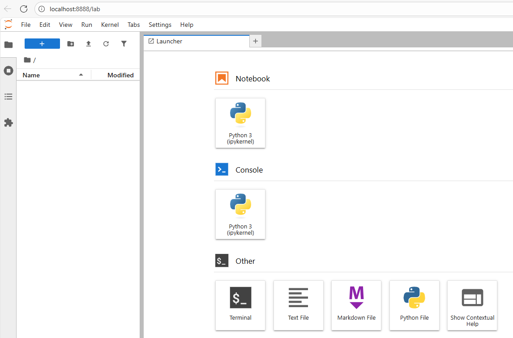

---
date:
    created: 2025-09-11
categories:
    - Python
tags:
    - Jupyter Notebook
---

# Using Jupyter from VS code or Standalone project

## VS code
To connect a uv-managed project to a Jupyter notebook within VS Code by creating a kernel of the project
VS Code requires ipykernel to be present in the project environment.

```
# Create a project.
uv init project

# Move into the project directory.
cd project

# Add ipykernel as a dev dependency.
uv add --dev ipykernel

# Open the project in VS Code.
code .
```

Press <ctl> + <Shift> + p and select "Create: New Jupyter Notebook"
It creates .ipynb file and select the python kernel right side of the note book

## Standalone
If you want to standalone project without need pyproject.toml and uv.lock then run the below commands

```
uv venv --seed
uv pip install pydantic
uv pip install jupyterlab
.venv\Scripts\jupyter lab
```

It launchs the url http://localhost:8888/lab. you can install additional packages via `!uv pip install`, or even `!pip install`.

[](../glimages/jupyter-notebook.png){.glightbox title="Jupyter Notebook"}

To launch the existing notebook again, `.venv\Scripts\jupyter lab`
---