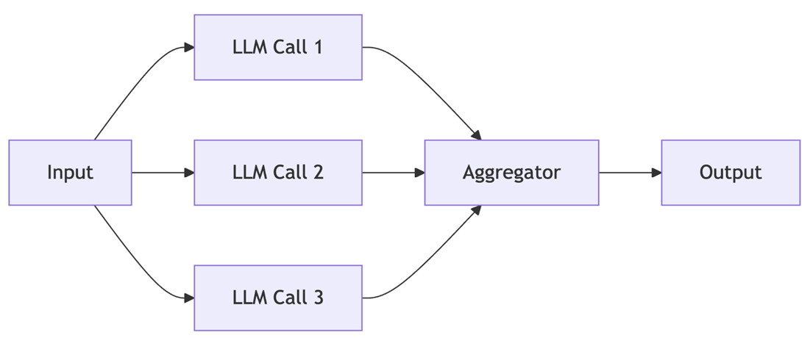
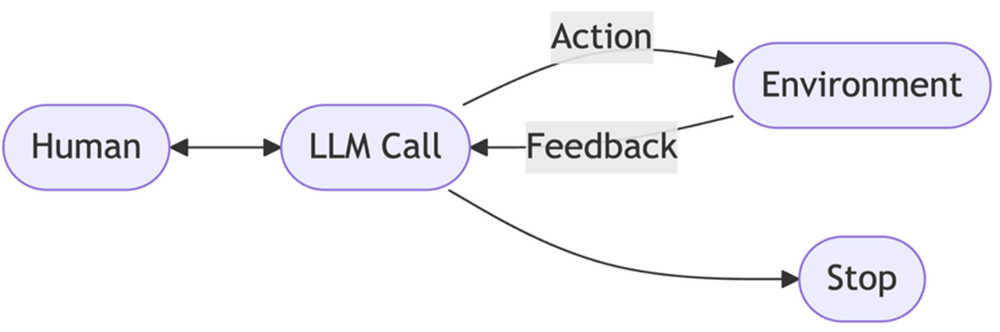

---
date:
    created: 2026-04-14
categories:
    - AI
tags:
    - AIAgents
---
# AI System Design

AI System design consists of three paradigms  
1. Single LLM feature  
2. Structure Workflow  
3. Autonomous Agents  

## Single LLM
Single LLM is a simple and perform single one shot task. It is stateless processing. No retention of information or context across interactions. It is straight forward request/response mechanism and suitable only for clearly defined, single step actions.

It is best usecase for simple well defined tasks that require no memory or multi-step logic. The main advantage is simple, speed, deterministic output and low cost

Example: 
- Text summarization 
- Sentiment classification 
- Informaiton extraction 
- Translation

## Structured Workflow
Structured workflows orchestrate LLM and tool calls through explicit, deterministic code paths. They're ideal for repetitive, multi-step, or compliance-heavy tasks. 

Consider processing insurance claims, where each document is scanned, information is extracted, validated, and stored. Each step must follow a precise, predictable order, making structured workflows ideal.

Best uses for repetitive, multi-step tasks with clear logic and minimal ambiguity, regulatory or compliance-driven applications. The limitation is to difficult to adapting to new scenarios and development overhead.

Example: 
- Document and data pipelines (Optical Character Recognition (OCR) → extraction → validation → storage) 
- Batch report generation 
- Financial and healthcare transaction processing

## Autonomous Agents
Autonomous Agents are flexible, context-aware reasoning. It allow LLMs to plan sequence actions and adapt as conditions change. Agents choose which tools to use and how to achieve their goals based on real-time context and feedback. 

It is best use for complex, open-ended tasks with unclear solution paths, scenarios requiring real-time adaptation and reasoning,        environments with high variability or need for personalization

The advantage is highly adaptable, dynamic decision making, reduces human intervention. The limitations are unpredictable outcomes, higher complexity cost.

Example: 
- Research Agent 
- Customer support and troubleshooting 
- Automation

| AI System type | Process | Use Case | Pros | Cons |
|---|---|---|---|---|
| Single LLM | Input → LLM → Output | Summarization, classification | Simple, fast, low cost | Not adaptable, lacks context |
| Workflow | Parallel LLMs → Aggregation → Output | Structured multi-step tasks | Predictable, easy to audit | Rigid, not dynamic |
| Agent | Plan → Act → Observe → (repeat agent loop) | Complex, adaptive automation | Flexible, learns from feedback | Unpredictable, complex, costlier |
