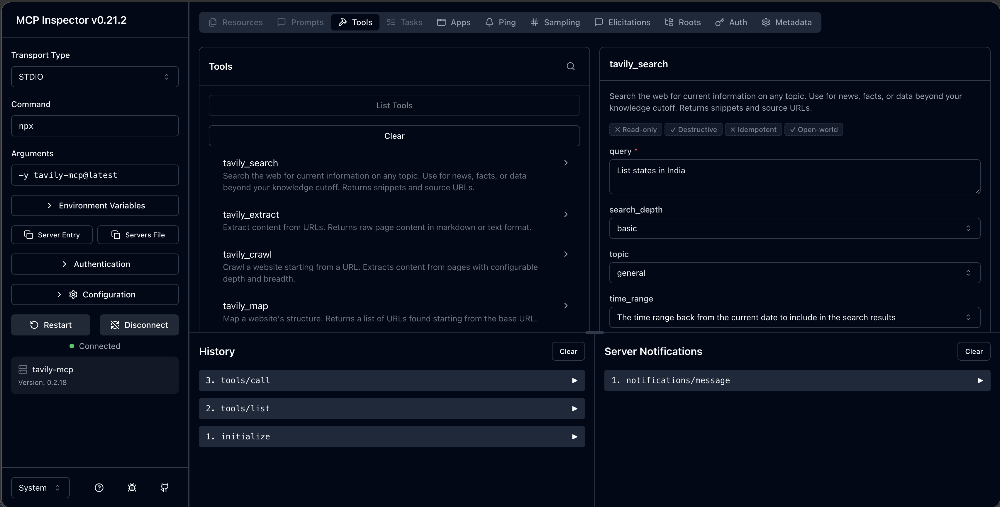

---
date:
    created: 2026-04-21
categories:
    - AI
tags:
    - AIAgents
---

# AI Agent - Running and Connecting the MCP server

MCP servers in the ecosystems are distributed as npm packages and run using npx. You can verify the node installation by checking the version. If it displays then the installation is successful.

```nodejs
node --version
```

## Running Tavily MCP server
Tavily MCP server provides the web search capability packaged as a ready to use MCP server. You can launch the Tavily MCP server using single command. Register the Tavily key in the environment variable.

```env
export TAVILY_API_KEY=<key>
```

Launch the server with MCP inspector. It is a browser based tool for testing the MCP servers. Run the below command and it launches the browser based tool http://localhost:6274/...

```js
npx @modelcontextprotocol/inspector npx -y tavily-mcp@latest
```

You will see several tabs Resources, Prompts and Tools. These reflect the capabilities exposed by the MCP server. Select the Tools tab and click List Tools. It will displays list of tools provided by the Tavily MCP server.

