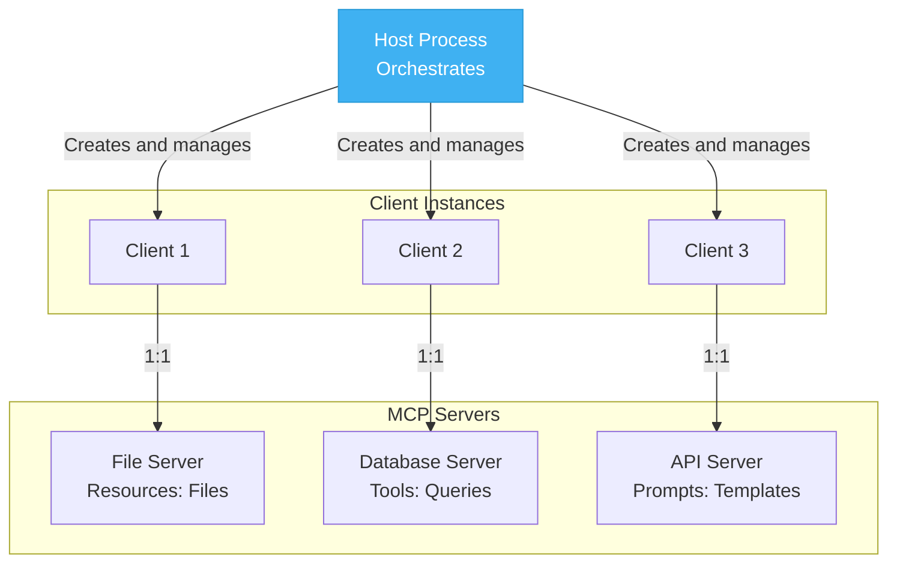

---
date:
    created: 2026-04-24
categories:
    - AI
tags:
    - AIAgents
---

# MCP Client/Server architecture

Developing tools that LLM agents can use is time-consuming and inconsistencies in implementation make them difficult to reuse.
Anthropic introduced MCP to bring a transformation to the LLM tool integration. MCP establishes a common language for LLM agents to communicate with tools. 

MCP consists of three component architecture: `Host`, `Client` and `Server`.

The `Host` is the application that interacts with users and make decisions using a LLM. It receives user input, performs reasoning, and decides which tools touse and when. Think of it as the "brain" of the system.

The `MCP client` acts as a bridge between the Host and MCP servers. When the Host decides it needs a tool, the client handles the communication, requesting available tool definitions from servers and forwarding tool execution requests. Each client maintain one connection to the MCP server.

The `MCP server` hosts the actual tools and executes them on demand. It responds what type of tools you have and execute this tool with these arguments. Servers can connects to the external resources such as databases and APIs.

## Transport Mechanism
MCP supports three transport mechanism for communication between clients and servers.

- `stdio (Standard I/O)` is the simplest approach. The client launches the server as a subprocesses and communicates through the standard input/output streams. Since everything runs locally on the same machine, there is no network overhead. This is ideal for local development.

- `Streamable HTTP` enables communicates over the network. The client sends the requests via HTTP and server streams responses back. 

- `Websocket` provides full bidirectional communication allowing both client and server to initiate messages. This is useful when servers need to push updates to clients proactively.

# Standardized Interfaces
MCP standardized two key interfaces `Tool Discovery` and `Tool Execution`

- `Tool Discovery`: The client request available tool definitions, and the server returns them in a standardized format. The tool developers implement the schema once and any MCP compatible client can automatically retrieve and use it
- `Tool Execution`: The client sends a tool execution to the server which handles execution and returns the result in a consistent format.

