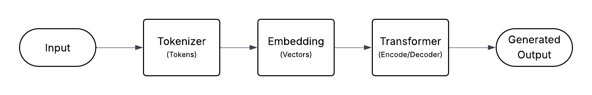

---
date:
    created: 2025-09-09
categories:
    - AI
---

# LLM Models and Parameters

## Models

Many LLM models are available on the market, which can make it overwhelming to choose the right one. In this article, we will look at the list of LLM categories, their functionalities, and important parameters for fine-tuning LLMs. LLMs revolve around the **Transformer architecture**, which powers many generative AI applications like chats, summarization, and translation. This architecture has three important components:

1.  **Tokenizer**: Converts text into tokens.
2.  **Embedding**: Turns tokens into vectors representing meaning and position.
3.  **Transformer**: Uses encoders, decoders, and self-attention to process and generate text.

{.glightbox title="Transformer Architecture"}

### Transformer Architectures

The Transformer supports three main architectures:

1.  **Encoder-only**: Best for understanding and classifying text (e.g., `BERT`, `RoBERTa`, `DistilBERT`).
2.  **Decoder-only**: Best for generating new text from prompts (e.g., `GPT`, `Llama`, `Mistral`).
3.  **Encoder-decoder**: Versatile for tasks like translation, summarization, and Q&A (e.g., `T5`, `BART`).

**OpenAI APIs** make it easy to use powerful language models without managing infrastructure. In contrast, the **Hugging Face Transformers library** allows for more customization and direct model control, including fine-tuning. Both are used for integrating AI into applications.

## Model Parameters

Below are the key parameters that influence text generation with Transformers:

*   **`Prompt`**: Sets the context for the model’s output. In chat models, prompts are split into `system` (instructions/role), `user` (questions/commands), and `assistant` (model’s responses).
*   **`max_new_tokens`**: Limits the number of tokens generated in the output, controlling the output length.
*   **`max_length`**: Limits the total length of the input plus the output. Use either `max_new_tokens` or `max_length`, not both.
*   **`temperature`**: Controls randomness. Higher values (closer to 1) make outputs more creative and varied; lower values make them more predictable and focused.
*   **`do_sample`**: If `false`, the model always picks the most likely next token (deterministic). If `true`, it samples from the probability distribution, resulting in more creative output.
*   **`top_k`**: When sampling, this restricts choices to the K most likely tokens. Lower values lead to more focused output, while higher values create more diverse results.
*   **`top_p`**: Samples from the smallest set of tokens whose cumulative probability exceeds a threshold, which allows for more dynamic and varied outputs.

Other parameters (like beam search, repetition penalties, etc.) offer further control. More details can be found in the Hugging Face Transformers documentation. These parameters let you balance creativity, coherence, and length in generated text, depending on your application’s needs.

# Categories of Models

## Code Generation Models

Code generation tools like **GitHub Copilot** and **Cursor** are powered by Transformer models trained on vast code datasets from sources like GitHub, Stack Overflow, and documentation. Many LLMs use reinforcement learning with human feedback (RLHF) to align outputs with professional coding standards. There are two main categories of code generation models:

*   **General-purpose LLMs** (e.g., `GPT-4`, `Claude`): These can generate both natural language and code, assisting with code completion, error correction, and test creation. They are best for prototyping and tasks involving both code and natural language.
*   **Specialized code models** (e.g., `CodeLlama`, `CodeT5`, `CodeBERT`): Trained specifically on code, these models excel at advanced tasks such as code search, clone detection, bug detection, and code translation. They are preferred for high-precision or domain-specific code tasks.

## Image Generation Models

**DALL·E** and **Stable Diffusion** create images from natural language prompts using diffusion, a process where noise is gradually removed to form a coherent image.

*   **DALL·E (by OpenAI)**:
    *   **Key parameters**:
        *   `quality`: `HD` or `standard`
        *   `size`: Output image dimensions
        *   `style`: `vivid` (hyperrealistic) or `natural` (authentic look)
*   **Stable Diffusion (open source)**:
    *   **Key parameters**:
        *   `seed`: Ensures reproducibility of images.
        *   `negative prompt`: Excludes unwanted elements.
        *   `width`/`height`: Image dimensions (optimized for 512x512).
        *   `steps`: Number of denoising steps (more steps = more detail).
        *   `scheduler`: Controls the denoising rhythm, affecting style and quality.
        *   `CFG scale`: Balances creativity and prompt adherence.

## Text-to-Speech (TTS) Models

TTS converts written text into natural-sounding audio. The TTS pipeline involves several steps:

1.  Text is cleaned and normalized.
2.  Words are mapped to phonemes, and prosody (rhythm, stress, intonation) is analyzed.
3.  Acoustic modeling generates a mel spectrogram.
4.  A neural vocoder (like `WaveNet` or `HiFi-GAN`) converts the spectrogram to raw audio.
5.  Optional post-processing can be applied.

Two popular TTS options are:

*   **OpenAI’s TTS API**: Simple and high-quality.
    *   **Key Parameters**:
        *   `voice`: Choose from preset voices (e.g., `Nova`, `Alloy`).
        *   `speed`: Controls speech rate.
        *   `instructions`: Guide delivery style (e.g., "excited," "positive").
*   **Chatterbox (Resemble AI)**: Open source and offers more control.
    *   **Key Parameters**:
        *   `exaggeration`: Controls expressiveness.
        *   `CFG weight`: Balances faithfulness to text.
        *   `audio prompt path`: Reference audio for voice adaptation.

## Multimodal Models (MLLMs)

Multimodal models (MLLMs) can process and understand multiple data types (text, images, audio) within a single system. Training is a two-phase process: aligning new modalities and then fine-tuning the full system.

*   **Unified Embedding Approach**: Modalities are encoded into the same embedding space as text. This is simple but can lose detail. Used in models like `Pix2Struct` and `Fuyu`.
*   **Cross-Attention Approach**: Image encodings are connected to the LLM via cross-attention layers, allowing selective focus. This is more complex but more powerful. Used in models like `Flamingo` and `LLaVA`.

# Fine-tuning Models

Fine-tuning large models is resource-intensive. **Parameter-Efficient Fine-Tuning (PEFT)** techniques adapt models by updating only a small number of parameters. The benefits include:

*   Much lower memory and compute requirements.
*   Tiny storage for task-specific parameters.
*   Preservation of original model knowledge.

Popular PEFT methods:

*   **`LoRA` (Low-Rank Adaptation)**: Adds small, trainable matrices to each layer.
*   **`QLoRA` (Quantized Low-rank Adaptation)**: Combines `LoRA` with quantization to fine-tune very large models on a single GPU.
*   **Prompt Tuning**: Learns a small set of trainable embeddings (“soft prompts”) prepended to the input.
*   **Prefix Tuning**: Injects trainable vectors (“prefixes”) into the attention mechanism of each layer.

# Costs

Model choice is only part of the challenge; cost is equally important.

*   **Hosted APIs (e.g., OpenAI, Anthropic, Google)**:
    *   Easy setup with no infrastructure to manage.
    *   Pricing is usually per token (text) or per request (image/audio).
    *   Use pricing calculators and token-counting libraries (like `tiktoken`) to estimate costs.
*   **Self-hosting open-source models (e.g., Llama, Mistral)**:
    *   More control and flexibility, but you manage the infrastructure.
    *   Costs are based on GPU rental (hourly billing).
    *   Use tools like Hugging Face’s model memory estimator to plan VRAM