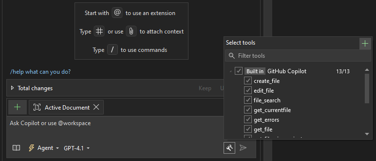
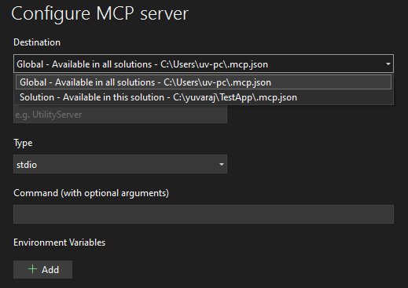

---
date:
    created: 2025-09-10
categories:
    - AI
tags:
    - MCP
---

# Configure MCP Server in Visual Studio and VS Code

This article explains how to configure MCP servers in Visual Studio and Visual Studio Code. The Model Context Protocol (MCP) enables servers to expose tools and services that MCP clients — such as GitHub Copilot or Claude — can consume.

This guide demonstrates how to configure the MCP Database server, which queries a SQL Server database and returns results to a chat agent. The agent can then interact with a large language model (LLM) to display results in the chat window or perform actions such as generating SQL or saving query results to a CSV file.

The MCP database server used in this guide is a Node package and can be installed globally with npm:

```bash
npm install -g @executeautomation/database-server
```

## VS Code configuration

1. Open VS Code and press Ctrl+Shift+P. Run `MCP: Add Server…`.
2. Select the MCP server type. Choose "Command (stdio)" from the list (other types include http, npm, pip, and docker).
3. For the command, enter: `npx`.
4. For Server Id, enter: `advworks-db`.
5. Choose the installation scope: Global or Workspace.
   - Global — available to all workspaces and runs locally
     - This creates `mcp.json` at `C:\Users\<user>\AppData\Roaming\Code\User\mcp.json`.
   - Workspace — available only in the current workspace and runs locally
     - This creates `.vscode\mcp.json` inside the workspace.

### Example `mcp.json` configuration

Replace `hostname\sqlexpress`, database name, and credentials with your own values.

```json
{
  "servers": {
    "advworks-db": {
      "type": "stdio",
      "command": "npx",
      "args": [
        "-y",
        "@executeautomation/database-server",
        "--sqlserver",
        "--server", "hostname\\sqlexpress",
        "--database", "AdventureWorks",
        "--user", "sa",
        "--password", "testpwd"
      ]
    }
  },
  "inputs": []
}
```

## Visual Studio configuration

1. Open the GitHub Copilot chat window and choose an agent (for example, GPT-4.1 or Claude).

[](../glimages/vs-mcp-server-copilot.png){.glightbox title="Github Copilot - Setup MCP Server"}

2. Click the tool icon in the chat window and choose "Select tools (+)".
3. In the "Configure MCP Server" dialog, add the server configuration.

[](../glimages/mcp-server-configure.png){.glightbox title="Configure MCP Server"}

You can configure the MCP server at either the Global level (available to all solutions) or the Solution level (available only to the current solution). The JSON format is the same as the example shown in the VS Code section.

## Example usage

In the GitHub Copilot chat window, select an agent and an LLM model, then ask a query such as:

"List the tables in the Person schema."

The agent will interact with the MCP database server to run the query and return the list of tables in the `Person` schema in the chat window.
