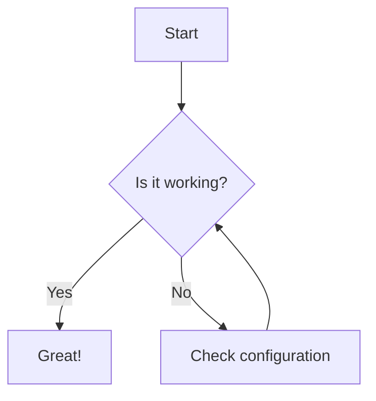

---
date:
    created: 2025-09-06
categories:
    - Programming
tags:
    - markup
    - markdown
    - code
authors:
    - yuva
draft: true
---
# Testing Markup Languages in MkDocs

This post demonstrates various markup language features supported by Markdown and MkDocs Material.

## Headings

# H1
## H2
### H3
#### H4

## Emphasis

*Italic*  
**Bold**  
***Bold and Italic***  
~~Strikethrough~~

## Lists

- Unordered item 1
- Unordered item 2
    - Nested item

1. Ordered item 1
2. Ordered item 2

## Links and Images

[GitHub](https://github.com/)


## Blockquotes

> This is a blockquote.
> 
> - Author

## Code

Inline code: `print("Hello, World!")`

```python
def greet(name):
    print(f"Hello, {name}!")
greet("World")
```

## Tables

| Syntax | Description |
|--------|-------------|
| Header | Title       |
| Cell   | Data        |

## Admonitions

!!! note
    This is a note admonition.

!!! warning
    This is a warning admonition.

## Task List

- [x] Write a post
- [ ] Test all markup features
- [ ] Publish the post

## Sample Mermaid Diagram



---

This concludes the markup language test